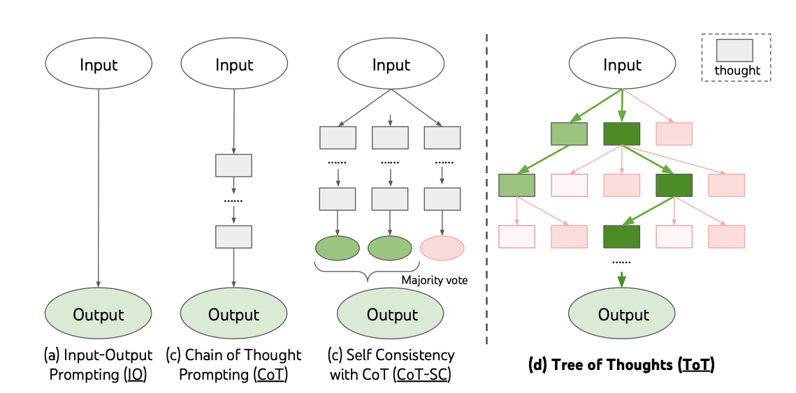
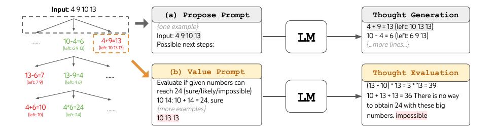
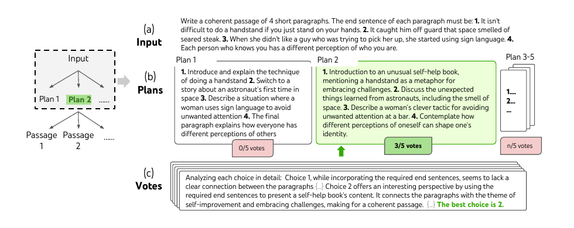
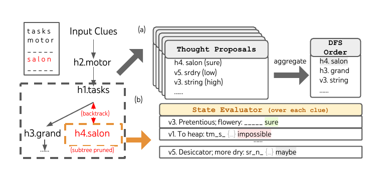

## Tree of Thoughts 速读精要

《Tree of Thoughts: Deliberate Problem Solving with Large Language Models》提出的是一种推理时搜索框架：不更新模型参数，只改变大语言模型在推理时组织中间步骤的方式。它把链式思维（Chain-of-Thought）里的线性中间步骤扩展成一棵可搜索的思维树（Tree of Thoughts），让模型能够生成多个候选、评估中间状态，并在必要时前瞻、剪枝和回溯。

## 一句话先看懂

**ToT 的核心问题是：如果任务需要探索、比较、前瞻和回溯，那么一条从左到右生成的 CoT 推理链是不够的。**

**ToT 的核心答案是：把中间推理步骤从“链上的一句话”升级成“树上的状态节点”，再用大语言模型自己生成候选、评估状态，并用搜索算法选择路径。**

## 1 引言

大语言模型已经能处理数学、符号、常识和知识推理任务，但底层生成方式仍然是逐 token、自左向右的自回归生成。这样的机制适合连续写作，却不天然适合复杂问题求解。很多任务不是沿着第一条思路一直写下去就能完成，而是需要尝试不同方向、比较局部方案、发现错误后回退。

论文借用认知科学中的“双系统”视角来说明动机：普通语言模型生成更像系统一（System 1），快速、自动、局部；复杂问题求解需要系统二（System 2），慢速、审慎、会规划。ToT 要做的就是在推理阶段给语言模型加上一层系统二式的搜索过程。

Figure 1: Schematic illustrating various approaches to problem solving with LLMs. Each rectangle box represents a thought, which is a coherent language sequence that serves as an intermediate step toward problem solving. See concrete examples of how thoughts are generated, evaluated, and searched in Figures 2,4,6.

图1：展示大语言模型解决问题的不同方式。每个矩形框代表一个思维单元，也就是作为问题求解中间步骤的连贯语言序列。图2、图4、图6展示这些思维单元如何生成、评估和搜索。

解释：输入输出提示（IO）是直接从问题到答案；链式思维（CoT）是一条推理链；自洽 CoT（CoT-SC）是采样多条完整链后投票；ToT 则把中间思维单元组织成树。**引言真正建立的范式变化是：从“生成一条推理路径”转向“搜索一个中间推理空间”。**

## 2 背景

输入输出提示直接把问题 `x` 映射为答案 `y`。它没有显式中间推理，因此遇到复杂任务时很容易一步到位失败。

链式思维在问题和答案之间加入中间思维步骤，例如数学题中的中间算式。它让模型能写出推理过程，但仍然是一次性生成一条完整链。早期步骤一旦走错，后面的生成基本只能沿着错误路径继续。

自洽 CoT 采样多条完整推理链，再对最终答案做多数投票。它扩大了最终答案层面的探索，但没有在每个中间步骤做局部探索，也没有回溯机制。多数投票也更适合答案空间有限的任务，例如选择题或数值题。

背景部分给 ToT 铺出的限制很明确：**CoT 已经证明“中间思维”有用，但这些思维仍然是线性的、一次性的；ToT 要把它们变成可生成、可评估、可选择、可回退的搜索节点。**

## 3 Tree of Thoughts：审慎问题求解框架

ToT 把问题求解建模为树搜索。树上的每个状态是：

$$
s = [x, z_{1...i}]
$$

其中 `x` 是原始输入，`z1...zi` 是目前已经生成的思维序列。一个状态表示“输入 + 当前部分解”，而不是单个 token。

完整流程可以压成一条线：

**输入问题 → 当前状态 → 生成候选思维 → 评估候选状态 → 搜索保留/剪枝/回溯 → 最终输出**

ToT 的核心贡献由四个组件构成：思维如何分解、候选思维如何生成、状态如何评估、使用什么搜索算法。

### 3.1 思维分解

思维单元是 ToT 的搜索单位，粒度必须根据任务设计。太小，例如一个 token，模型无法判断它是否有助于最终解；太大，例如完整答案，又会退化成直接生成，失去搜索意义。

论文中的三个任务对应三种粒度：

| 任务 | 思维单元 |
|---|---|
| Game of 24 | 一步中间算式 |
| Creative Writing | 一个写作计划 |
| Mini Crosswords | 一个待填单词 |

关键设计原则是：**思维单元要小到能生成多个候选，又要大到能被模型评估其前景。** 这也是 ToT 相比 token-level 生成更高层的地方。

### 3.2 思维生成器

思维生成器 `G(pθ, s, k)` 从当前状态 `s` 生成 `k` 个下一步候选。

开放空间任务适合独立采样：

$$
z^{(j)} \sim p^{CoT}_\theta(z_{i+1} \mid s)
$$

Creative Writing 就属于这种情况。写作计划有很多合理方向，独立采样可以带来多样性。

受限空间任务适合 proposal prompt，也就是一次性提出多个候选：

$$
[z^{(1)}, ..., z^{(k)}] \sim p^{propose}_\theta(z^{(1...k)}_{i+1} \mid s)
$$

Game of 24 和 Mini Crosswords 更适合这种方式。候选本身较短、空间较受限，把多个候选放在同一上下文中提出，可以减少重复并提高覆盖。

这里的重点不是让模型直接给答案，而是让模型扩展搜索树。**生成器决定了搜索空间里有哪些分支可走。**

### 3.3 状态评估器

状态评估器 `V(pθ, S)` 给搜索过程提供启发式信号。传统搜索里的启发式函数通常由人工规则或训练模型给出；ToT 的做法是让语言模型自己用语言推理来评估当前状态。

论文使用两类评估：

| 评估方式 | 机制 | 适用任务 |
|---|---|---|
| 独立估值 | 对每个状态单独打分或分类 | Game of 24、Mini Crosswords |
| 候选投票 | 在多个候选之间比较并投票 | Creative Writing |

Game of 24 中，模型判断当前剩余数字是否还能得到 24，例如 `sure / likely / impossible`。Mini Crosswords 中，模型判断当前字母约束下剩余线索是否仍可填。Creative Writing 中，模型比较多个写作计划，选出最有希望生成连贯文章的方案。

评估器不需要完美。它只要足够帮助搜索过滤明显差的分支，就能带来收益。**ToT 的关键在于让语言模型同时扮演两个角色：候选生成器和搜索启发式评估器。**

### 3.4 搜索算法

ToT 将思维生成和状态评估接入标准搜索算法。

广度优先搜索（BFS）用于树深较浅的任务，例如 Game of 24 和 Creative Writing。每一层展开候选，只保留得分最高的 `b` 个状态继续探索。

深度优先搜索（DFS）用于更深、更需要回溯的任务，例如 Mini Crosswords。模型优先探索最有希望的状态；如果评估器判断当前状态无法继续完成，就剪枝并回到父节点。

论文给出两个算法：ToT-BFS 和 ToT-DFS。算法本身不复杂，重要的是它把语言模型生成、语言模型自评和经典搜索流程组合到一起。

ToT 的整体特点有四个：

- **通用性**：IO、CoT、CoT-SC 都可以看成 ToT 的退化形式。
- **模块性**：基础模型、思维粒度、生成方式、评估方式、搜索算法都能替换。
- **适应性**：不同任务可以选不同搜索结构。
- **便利性**：不需要训练新模型，只需要预训练语言模型和合适的提示。

## 4 实验

实验主要证明 ToT 在需要规划、探索和回溯的任务上比 IO、CoT、CoT-SC 更合适。实验部分不需要逐表展开，抓住每个任务证明了什么即可。

Game of 24 验证的是早期决策很关键的数学搜索。ToT 把思维设为一步中间算式，用 BFS 保留多个候选路径。关键结果是：IO 7.3%，CoT 4.0%，CoT-SC 9.0%，ToT `b=5` 达到 74%；即使 CoT 采样 100 次，best-of-100 也只有 49%。**结论是 ToT 的提升来自中间步骤层面的搜索，而不是简单多采样完整答案。**

> 图2：在 Game of 24 中，语言模型先通过 proposal prompt 生成下一步算式，再通过 value prompt 判断剩余数字是否仍有机会得到 24。绿色路径表示可继续探索的候选，红色路径表示应被剪枝的候选。

Creative Writing 验证开放式规划。ToT 先生成多个写作计划并投票，再基于选出的计划写文章。自动连贯性评分和人工盲评都更偏向 ToT。**结论是 ToT 不只适合唯一答案任务，也能用于开放式任务中的高层方案比较。**

> 图4：模型从同一输入采样多个写作计划，通过多次投票选择最有希望的计划，再使用相同的“采样—投票”过程生成最终文章。

Mini Crosswords 验证深层约束搜索。ToT 把思维设为一个线索对应的填词，用 DFS、剪枝和回溯逐步填棋盘。IO 和 CoT 的单词级成功率不到 16%，ToT 提升到 60%，并解出 4/20 个完整 crossword。消融表明剪枝和回溯都很重要。**结论是 ToT 在约束强、路径深的任务上尤其依赖状态评估和回溯能力。**

> 图6：模型为未填写的线索提出候选并按置信度排序；状态评估器逐条检查剩余线索，一旦发现某条线索已不可能完成，就剪掉当前子树并回溯到父状态。

## 5 相关工作

ToT 和四类工作关系最紧密。

规划与决策方向关注如何让语言模型生成计划。ToT 的区别在于，它不只生成一个计划，而是在每个中间状态保留多个候选并用评估反馈推进搜索。

自反思方向让模型评价自己的输出。ToT 把这种评价提前到中间状态层面，不只是最终答案生成后再修补。

程序引导生成方向用外部程序或系统流程组织语言模型。ToT 的搜索节点来自模型自己的语言思维，而不是完全依赖外部规划器。

经典搜索方向提供 BFS、DFS、A* 等结构。ToT 的新意是让语言模型负责生成候选和提供启发式评估，再由搜索算法组织探索。

## 6 讨论与结论

ToT 不适合默认替代所有 prompting。对 GPT-4 + CoT 已经表现很好的任务，额外搜索可能收益有限，却会带来更高成本。它更适合那些 CoT 明显吃力、需要审慎推理、规划、搜索和回溯的任务。

成本来自多个候选生成、状态评估、投票和搜索。论文建议根据任务难度和预算调节搜索宽度、投票次数、模型选择和剪枝策略。

结论部分把 ToT 收束回 System 1 / System 2 的类比：语言模型原本的自回归生成提供快速语言能力，ToT 用思维树搜索提供审慎问题求解能力。**ToT 的核心贡献不是让模型知道更多知识，而是让模型在推理时更好地组织已有能力。**

## 附录核心补充

附录 A 说明代码、提示和轨迹都开源。对理解 ToT 最有价值的一点是：ToT 不是一个总 prompt，而是一组分工明确的提示，包括候选生成、状态评估和投票选择。

附录 B.1 把 ToT 扩展到 GSM8K 和 StrategyQA。结果只比 CoT 略好，说明当 GPT-4 + CoT 已经足够强时，ToT 的边际收益有限。

附录 B.2 测试 GPT-3.5。整体仍然呈现 `ToT > CoT > IO`，但 Game of 24 中 GPT-3.5 + ToT 远低于 GPT-4 + ToT。进一步拆分显示，瓶颈更偏思维生成，而不是状态评估。

附录 B.3 讨论成本。ToT 可能需要更多 token 和更多调用，适合用在确实需要搜索、规划和回溯的困难任务上。

## 最终核心

ToT 的思想链路可以压成一句：

**CoT 是线性推理链，无法局部探索和回溯；ToT 把中间思维变成树节点，让语言模型生成候选并评估状态，再用搜索算法选择、剪枝和回溯。**

这篇论文最重要的价值不在某个实验数字，而在它把 prompting 从“写出一条推理链”推进到“构造并搜索一个中间推理空间”。
